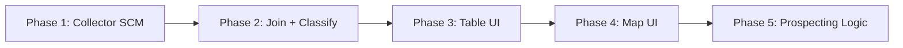

# feat: Levantamento de Decretos de Lavra e Instrumentos Similares em MG

## Overview

Coletar, consolidar e visualizar todos os **decretos de lavra** (Portarias de Lavra) e **instrumentos similares** (Licenciamento, PLG, Registro de Extração) vigentes em Minas Gerais. Apresentar em lista filtrável e mapa interativo, com classificações por tipo de minério, titular, atividade produtiva e localização. Objetivo final: **prospecção de novos negócios em mineração**.

## Problem Statement / Motivation

O projeto já coleta dados do SIGMINE (geometrias de processos minerários) e CFEM (arrecadação). Porém:

1. **Faltam dados estruturados de concessões** — o SIGMINE não tem CNPJ, município, nem detalhes do titular
2. **Não existe visualização em mapa** — nenhuma página do app renderiza polígonos
3. **Não há ferramenta de prospecção** — identificar concessões inativas, áreas de alto valor, ou oportunidades de aquisição exige cruzamento manual de múltiplas fontes

Os dados abertos do SCM (Sistema de Cadastro Mineiro) da ANM preenchem essa lacuna: CSVs com CNPJ, substância, município e status, atualizados diariamente.

## Data Sources

### Novos (a coletar)

| Fonte | URL | Formato | Campos-chave |
|-------|-----|---------|--------------|
| SCM Portaria de Lavra | `app.anm.gov.br/dadosabertos/SCM/Portaria_de_Lavra.csv` | CSV ~3.5MB | Processo, CPF/CNPJ, Titular, Município(s), Substância(s), Fase Atual, Situação |
| SCM Licenciamento | `app.anm.gov.br/dadosabertos/SCM/Licenciamento.csv` | CSV ~4.5MB | Idem |
| SCM PLG | `app.anm.gov.br/dadosabertos/SCM/PLG.csv` | CSV ~716KB | Idem |
| SCM Registro de Extração | `app.anm.gov.br/dadosabertos/SCM/Registro_de_Extracao_Publicado.csv` | CSV ~811KB | Idem |

### Existentes (já coletados)

| Fonte | View DuckDB | Uso |
|-------|-------------|-----|
| SIGMINE ArcGIS | `v_anm` | Geometrias (polígonos) dos processos |
| CFEM Arrecadação | `v_cfem` | Atividade produtiva (pagamentos de royalties) |
| CNPJ Receita | `v_cnpj` | Enriquecimento de dados da empresa |
| Spatial Overlaps | `v_spatial` | Sobreposições com UCs, TIs, biomas |

### Limitações Conhecidas

- **Reservas/recursos minerais por processo NÃO estão disponíveis** nos dados abertos — RAL (Relatório Anual de Lavra) individual é acesso restrito
- **CFEM como proxy de atividade** — pagamento de CFEM indica produção ativa; ausência NÃO é conclusiva (mina pode estar em manutenção)
- **Datas de concessão** não constam nos CSVs do SCM — o ano está embutido no número do processo (ex: `/1997`)

## Proposed Solution

### Architecture

```
SCM CSVs ──► anm_scm.py ──► scm_concessoes.parquet ──┐
                                                       ├──► join_concessions.py ──► concessoes_mg.parquet
SIGMINE shapefile ──► spatial.py ──► anm_geometrias ──┘              │
                                                                      ├──► v_concessoes (DuckDB)
CFEM parquet ──────────────────────────────────────────────────────────┘
```

### Fases



## Technical Approach

### Phase 1: Collector SCM + Config (~Day 1)

**Objetivo**: Coletar os 4 CSVs do SCM, filtrar para MG, normalizar e salvar como parquet.

**Arquivos a criar/modificar**:

<details>
<summary>src/licenciaminer/collectors/anm_scm.py (NOVO)</summary>

```python
# Coletor dos CSVs do Sistema de Cadastro Mineiro (SCM/ANM)
# Downloads: Portaria_de_Lavra, Licenciamento, PLG, Registro_de_Extracao
# Filtra por UF, normaliza colunas, salva como parquet unificado.

SCM_FILES = {
    "portaria_lavra": "Portaria_de_Lavra.csv",
    "licenciamento": "Licenciamento.csv",
    "plg": "PLG.csv",
    "registro_extracao": "Registro_de_Extracao_Publicado.csv",
}

def collect_scm(data_dir: Path, uf: str = "MG") -> Path:
    """Download SCM CSVs, filter to UF, unify, save as parquet."""
    frames = []
    for regime, filename in SCM_FILES.items():
        url = f"{SCM_BASE_URL}/{filename}"
        df = _download_csv(url)
        df["regime"] = regime
        # Filter: Municipio(s) ends with " - {uf}"
        df = df[df["municipios"].str.contains(f"- {uf}", na=False)]
        frames.append(df)

    unified = pd.concat(frames, ignore_index=True)
    unified = normalize_columns(unified)
    unified["processo_norm"] = unified["processo"].apply(normalize_processo)
    add_metadata(unified, source="anm_scm")
    output = data_dir / "processed" / "scm_concessoes.parquet"
    atomic_parquet_write(unified, output)
    return output
```

</details>

<details>
<summary>src/licenciaminer/config.py (MODIFICAR)</summary>

Adicionar:
```python
SCM_BASE_URL = os.getenv("SCM_BASE_URL", "https://app.anm.gov.br/dadosabertos/SCM")
```

</details>

<details>
<summary>src/licenciaminer/processors/normalize.py (MODIFICAR)</summary>

Adicionar função de normalização de número de processo:
```python
def normalize_processo(processo: str) -> str:
    """Normalize ANM process number to NNNNNN/YYYY format.

    Handles: '005.370/1964', '5370/1964', '005370/1964', '830.836/1997'
    """
    clean = re.sub(r"[.\s]", "", str(processo).strip())
    match = re.match(r"(\d+)/(\d{4})", clean)
    if match:
        return f"{int(match.group(1)):06d}/{match.group(2)}"
    return clean
```

</details>

<details>
<summary>src/licenciaminer/cli.py (MODIFICAR)</summary>

Adicionar comando `collect scm`:
```python
@collect.command()
@click.option("--uf", default="MG", help="UF para filtrar")
@click.pass_context
def scm(ctx, uf):
    """Baixa dados do Sistema de Cadastro Mineiro (concessões ativas)."""
    from licenciaminer.collectors.anm_scm import collect_scm
    path = collect_scm(ctx.obj["data_dir"], uf=uf)
    click.echo(f"SCM: dados salvos em {path}")
```

</details>

<details>
<summary>src/licenciaminer/database/schema.py (MODIFICAR)</summary>

Adicionar:
```python
"v_scm": "scm_concessoes.parquet",
```

</details>

<details>
<summary>tests/test_anm_scm.py (NOVO)</summary>

- Mockar download dos CSVs com dados de fixture
- Verificar filtragem por UF
- Verificar normalização do número de processo
- Verificar colunas de metadata (_source, _collected_at)
- Verificar unificação dos 4 regimes

</details>

**Acceptance Criteria Phase 1**:
- [ ] `uv run python -m licenciaminer collect scm` baixa os 4 CSVs e gera `scm_concessoes.parquet`
- [ ] Filtro por UF funciona (default: MG)
- [ ] Coluna `regime` identifica o tipo de concessão (portaria_lavra, licenciamento, plg, registro_extracao)
- [ ] Coluna `processo_norm` permite join com SIGMINE
- [ ] `collect all` inclui SCM
- [ ] Testes passam com `uv run pytest tests/test_anm_scm.py`

---

### Phase 2: Join Pipeline + Classificação (~Day 2)

**Objetivo**: Juntar SCM (dados tabulares) + SIGMINE (geometrias) + CFEM (atividade) em dataset unificado. Criar tabela de classificação de substâncias.

**Arquivos a criar/modificar**:

<details>
<summary>src/licenciaminer/processors/join_concessions.py (NOVO)</summary>

```python
def join_concessions(data_dir: Path) -> Path:
    """Join SCM + SIGMINE + CFEM into unified concessions dataset.

    Join strategy:
    1. SCM ←LEFT JOIN→ SIGMINE on processo_norm (adds geometry, area_ha)
    2. Result ←LEFT JOIN→ CFEM aggregated (adds cfem_total, cfem_ultimo_ano, ativo_cfem)
    3. Enrich with substance classification
    """
    # Load sources
    scm = pd.read_parquet(data_dir / "processed" / "scm_concessoes.parquet")

    # SIGMINE: normalize processo from existing anm_processos.parquet
    sigmine = pd.read_parquet(data_dir / "processed" / "anm_processos.parquet")
    sigmine["processo_norm"] = sigmine["processo"].apply(normalize_processo)

    # CFEM: aggregate by processo
    cfem = pd.read_parquet(data_dir / "processed" / "anm_cfem.parquet")
    cfem_agg = cfem.groupby("processo_norm").agg(
        cfem_total=("valor_recolhido", "sum"),
        cfem_ultimo_ano=("ano", "max"),
        cfem_qtd_anos=("ano", "nunique"),
    ).reset_index()

    # Joins
    result = scm.merge(sigmine[["processo_norm", "area_ha", "subs", "uf"]],
                       on="processo_norm", how="left", suffixes=("", "_sigmine"))
    result = result.merge(cfem_agg, on="processo_norm", how="left")

    # Activity flag
    result["ativo_cfem"] = result["cfem_ultimo_ano"] >= (datetime.now().year - 2)

    # Substance classification
    subs_map = pd.read_csv(data_dir / "reference" / "substancias_classificacao.csv")
    result = result.merge(subs_map, left_on="substancia_principal", right_on="substancia", how="left")

    output = data_dir / "processed" / "concessoes_mg.parquet"
    atomic_parquet_write(result, output)
    return output
```

</details>

<details>
<summary>data/reference/substancias_classificacao.csv (NOVO)</summary>

Tabela de referência mapeando substâncias brutas para categorias:

| substancia | categoria | valor_relativo | estrategico |
|------------|-----------|---------------|-------------|
| MINERIO DE FERRO | Metálicos Ferrosos | alto | sim |
| OURO | Metálicos Preciosos | muito_alto | sim |
| LITIO | Metálicos Estratégicos | muito_alto | sim |
| NIOBIO | Metálicos Estratégicos | muito_alto | sim |
| BAUXITA | Metálicos Não-Ferrosos | alto | sim |
| MANGANES | Metálicos Ferrosos | alto | sim |
| AREIA | Construção Civil | baixo | não |
| BRITA | Construção Civil | baixo | não |
| CALCARIO | Industrial | médio | não |
| AGUA MINERAL | Água | baixo | não |
| GRANITO | Rochas Ornamentais | médio | não |
| ... | ... | ... | ... |

A tabela será populada a partir dos valores reais do dataset após a primeira coleta.

</details>

<details>
<summary>src/licenciaminer/database/schema.py (MODIFICAR)</summary>

Adicionar:
```python
"v_concessoes": "concessoes_mg.parquet",
```

</details>

**Campos Multi-valor**: `substancias` e `municipios` nos CSVs do SCM são separados por vírgula. O processador deve:
1. Criar coluna `substancia_principal` (primeira da lista)
2. Criar coluna `municipio_principal` (primeiro da lista)
3. Manter campos originais para busca textual

**Acceptance Criteria Phase 2**:
- [ ] Join SCM↔SIGMINE funciona via `processo_norm` — reportar match rate nos logs
- [ ] Join com CFEM adiciona flags de atividade (`ativo_cfem`, `cfem_total`, `cfem_ultimo_ano`)
- [ ] `concessoes_mg.parquet` gerado com todos os campos consolidados
- [ ] Classificação de substâncias aplicada (categoria, valor_relativo, estrategico)
- [ ] Campos multi-valor parseados (substancia_principal, municipio_principal)
- [ ] `v_concessoes` view criada no DuckDB
- [ ] Proveniência dos dados preservada: colunas `_source` indicam origem de cada campo

---

### Phase 3: Página de Tabela (~Day 3)

**Objetivo**: Nova página Streamlit com lista filtrável de todas as concessões.

**Arquivos a criar/modificar**:

<details>
<summary>app/pages/4_concessoes.py (NOVO)</summary>

Layout:
```
┌─────────────────────────────────────────────────────────┐
│  CONCESSÕES MINERÁRIAS — MINAS GERAIS                   │
├─────────────────────────────────────────────────────────┤
│  KPIs: [Total] [Ativas CFEM] [Portarias] [Substâncias] │
├──────────┬──────────────────────────────────────────────┤
│ FILTROS  │  TABELA                                      │
│          │  ┌──────────────────────────────────────────┐│
│ Regime   │  │ Processo | Titular | Substância | Munic. ││
│ Substânc │  │ ...      | ...     | ...        | ...    ││
│ Categor. │  │ ...      | ...     | ...        | ...    ││
│ Municip. │  └──────────────────────────────────────────┘│
│ Ativo?   │                                              │
│ Busca    │  [Exportar CSV] [Ver no Mapa]                │
│ titular  │                                              │
└──────────┴──────────────────────────────────────────────┘
```

Filtros sidebar:
- **Regime**: multiselect (Portaria de Lavra, Licenciamento, PLG, Registro de Extração)
- **Categoria de substância**: multiselect (Metálicos, Construção, Industrial, etc.)
- **Substância**: multiselect (populado dinamicamente)
- **Município**: multiselect
- **Ativo (CFEM)**: toggle (todos / ativo / inativo)
- **Busca por titular/CNPJ**: text input

Colunas da tabela (default):
1. Processo
2. Regime
3. Titular
4. CNPJ
5. Substância(s)
6. Categoria
7. Município
8. Área (ha)
9. Status CFEM
10. CFEM Total (R$)

Detalhe (expander ao clicar):
- Todos os campos
- Link para consulta no SCM: `https://sistemas.anm.gov.br/SCM/Extra/site/admin/pesquisarProcessos.aspx`
- Link para SIGMINE
- Dados de CFEM por ano

</details>

<details>
<summary>app/components/data_loader.py (MODIFICAR)</summary>

Registrar nova fonte em `source_urls` e `source_names`.

</details>

**Acceptance Criteria Phase 3**:
- [ ] Página carrega em <3s com dataset completo
- [ ] Todos os filtros funcionam e são combináveis
- [ ] Exportar CSV baixa os dados filtrados
- [ ] Links para fontes originais (SCM, SIGMINE) funcionam — auditabilidade
- [ ] Design segue o tema "Geological Editorial" existente
- [ ] Funciona no Streamlit Cloud (memory < 400MB)

---

### Phase 4: Mapa Interativo (~Day 4-5)

**Objetivo**: Visualização geoespacial das concessões em mapa interativo.

**Tecnologia**: `folium` + `streamlit-folium` — melhor suporte a polígonos, leve, maduro.

**Arquivos a criar/modificar**:

<details>
<summary>app/pages/5_mapa_concessoes.py (NOVO)</summary>

Layout:
```
┌─────────────────────────────────────────────────────────┐
│  MAPA DE CONCESSÕES — MINAS GERAIS                      │
├──────────┬──────────────────────────────────────────────┤
│ FILTROS  │  ┌──────────────────────────────────────────┐│
│          │  │                                          ││
│ Regime   │  │           MAPA FOLIUM                    ││
│ Substânc │  │       (polígonos coloridos)              ││
│ Colorir  │  │                                          ││
│ por:     │  │   click → popup com detalhes             ││
│ [categ.] │  │                                          ││
│ [ativo]  │  └──────────────────────────────────────────┘│
│ [regime] │                                              │
│          │  Legenda: [cores por categoria]               │
│ Layers   │  N registros: XXX | Com geometria: XXX       │
│ □ UCs    │                                              │
│ □ TIs    │                                              │
└──────────┴──────────────────────────────────────────────┘
```

</details>

**Performance**:
- Limitar renderização a **max 5.000 polígonos** por vez — se filtro retornar mais, mostrar aviso
- Simplificar geometrias com tolerance=0.001° (~100m) via `shapely.simplify()`
- Usar `folium.GeoJson` com estilo condicional por categoria
- Cache da geometria simplificada em `@st.cache_data`

**Popup do polígono** (ao clicar):
```
Processo: 830.836/1997
Titular: Mineração XYZ Ltda
Substância: Minério de Ferro
Área: 250.3 ha
CFEM (último ano): R$ 1.234.567
Status: Ativo
[Link SCM] [Link SIGMINE]
```

**Layers de restrição** (toggles):
- Unidades de Conservação (já em `data/reference/icmbio_ucs.parquet`)
- Terras Indígenas (já em `data/reference/funai_tis.parquet`)

**Acceptance Criteria Phase 4**:
- [ ] Mapa renderiza polígonos de concessões com cor por categoria
- [ ] Click no polígono mostra popup com detalhes e links
- [ ] Filtros da sidebar limitam polígonos exibidos
- [ ] Toggle de layers UCs/TIs funciona
- [ ] Performance aceitável: <5s para carregar com 5.000 polígonos
- [ ] Concessões sem geometria mostram aviso (não aparecem no mapa, mas aparecem na tabela)
- [ ] Centro e zoom default: MG (-19.9, -43.9), zoom 7

---

### Phase 5: Lógica de Prospecção (~Day 6)

**Objetivo**: Transformar dados brutos em insights de prospecção de negócios.

**Arquivos a criar/modificar**:

<details>
<summary>app/pages/6_prospeccao.py (NOVO)</summary>

**Indicadores de oportunidade**:

| Sinal | Fonte | Interpretação |
|-------|-------|---------------|
| CFEM zero nos últimos 2 anos | CFEM | Concessão potencialmente inativa |
| CFEM declinante (YoY) | CFEM | Produção em queda |
| Substância estratégica | Classificação | Alto valor (lítio, nióbio, ouro, terras raras) |
| Área grande (>500 ha) | SIGMINE | Potencial de escala |
| Sem sobreposição com UCs/TIs | Spatial | Menor risco regulatório |
| Empresa com muitas concessões | SCM | Portfolio consolidado (aquisição potencial) |

**Score de oportunidade** (v1, simples):
```python
score = 0
if not ativo_cfem: score += 30        # Concessão inativa
if estrategico: score += 25            # Mineral estratégico
if area_ha > 500: score += 15          # Área significativa
if not sobreposicao_uc_ti: score += 15 # Sem restrição espacial
if cfem_declinante: score += 15        # Produção em queda
# score: 0-100
```

Layout da página:
```
┌─────────────────────────────────────────────────────────┐
│  PROSPECÇÃO DE OPORTUNIDADES                            │
├─────────────────────────────────────────────────────────┤
│  TOP OPORTUNIDADES (ordenado por score)                 │
│  ┌─────────────────────────────────────────────────────┐│
│  │ Score | Processo | Substância | Área | Motivo       ││
│  │ 85    | 830836   | Lítio      | 800ha| Inativo+Estr ││
│  │ 70    | 123456   | Ouro       | 200ha| Declínio     ││
│  └─────────────────────────────────────────────────────┘│
│                                                         │
│  ANÁLISE POR EMPRESA                                    │
│  [Selecionar empresa] → portfolio de concessões         │
│                                                         │
│  HEATMAP DE SUBSTÂNCIAS POR REGIÃO                      │
│  [Mapa de calor com concentração de minerais por munic] │
│                                                         │
│  [Exportar shortlist CSV]                               │
└─────────────────────────────────────────────────────────┘
```

</details>

**Acceptance Criteria Phase 5**:
- [ ] Score de oportunidade calculado para cada concessão
- [ ] Ranking ordenado por score com justificativa
- [ ] Análise por empresa (portfolio de concessões por CNPJ)
- [ ] Exportar shortlist em CSV
- [ ] Todas as métricas auditáveis — link para fonte dos dados

---

## Decisões de Design

| Decisão | Escolha | Justificativa |
|---------|---------|---------------|
| Escopo de regimes | Portaria de Lavra + Licenciamento + PLG + Registro de Extração | Cobrem todos os instrumentos que autorizam lavra ativa |
| Escopo geográfico | MG (default), parametrizável por UF | MG é prioridade; estrutura suporta expansão |
| Biblioteca de mapa | folium + streamlit-folium | Suporte maduro a polígonos, leve, Leaflet-based |
| Limite de polígonos | 5.000 por renderização | Performance no browser; filtros reduzem dataset |
| "Ativo" = CFEM nos últimos 2 anos | Proxy, não definitivo | Único sinal disponível em dados abertos |
| Reservas/recursos | NÃO incluídas (indisponíveis) | Dados do RAL individual são de acesso restrito |
| Join SCM↔SIGMINE | por processo_norm (NNNNNN/YYYY) | Identificador único do processo minerário |

## Dependencies & Risks

| Risco | Probabilidade | Impacto | Mitigação |
|-------|--------------|---------|-----------|
| Formato de processo incompatível entre fontes | Média | Alto | Testar join com amostra antes de construir UI |
| SCM CSVs mudam schema | Baixa | Médio | Validar colunas esperadas, falhar com mensagem clara |
| Performance do mapa com muitos polígonos | Alta | Médio | Limite de 5K, simplificação de geometria, filtros |
| SIGMINE API fora do ar | Média | Baixo | Geometrias já coletadas no `anm_processos.parquet` existente |
| CFEM não cobre todas as concessões ativas | Alta | Médio | Tratar "sem CFEM" como "desconhecido", não como "inativo" |

## Dependências de Pacotes

```toml
# pyproject.toml — extras ou dependencies
folium = ">=0.15"
streamlit-folium = ">=0.17"
geopandas = ">=0.14"  # já instalado
shapely = ">=2.0"     # já instalado
```

## Success Metrics

- [ ] Dataset unificado com >90% de match rate no join SCM↔SIGMINE
- [ ] Tempo de coleta total < 5 minutos
- [ ] Página de tabela carrega em < 3s
- [ ] Mapa renderiza 5.000 polígonos em < 5s
- [ ] Score de oportunidade identifica ao menos 50 concessões inativas com minerais estratégicos em MG
- [ ] Todos os dados auditáveis — cada campo com link para fonte original

## References & Research

### Internal
- [anm.py](src/licenciaminer/collectors/anm.py) — Collector SIGMINE existente (padrão a seguir)
- [anm_cfem.py](src/licenciaminer/collectors/anm_cfem.py) — Collector CSV simples (modelo para SCM)
- [spatial.py](src/licenciaminer/collectors/spatial.py) — Download bulk shapefile + spatial joins
- [normalize.py](src/licenciaminer/processors/normalize.py) — Funções de normalização
- [schema.py](src/licenciaminer/database/schema.py) — Registry de views DuckDB
- [theme.py](app/styles/theme.py) — Design system "Geological Editorial"

### External
- [ANM Dados Abertos — SCM](https://app.anm.gov.br/dadosabertos/scm/) — CSVs de processos por regime
- [Portaria_de_Lavra.csv](https://app.anm.gov.br/dadosabertos/SCM/Portaria_de_Lavra.csv) — Download direto
- [SIGMINE FeatureServer](https://geo.anm.gov.br/arcgis/rest/services/SIGMINE/dados_anm/FeatureServer/0)
- [Decreto 9.406/2018](https://www.planalto.gov.br/ccivil_03/_ato2015-2018/2018/decreto/d9406.htm) — Regulamento do Código de Mineração
- [dados.gov.br — ANM](https://dados.gov.br/organization/agencia-nacional-de-mineracao-anm)

### Legal Context
- "Decreto de Lavra" é terminologia histórica → instrumento atual é **Portaria de Lavra** (Ministro de Minas e Energia) ou **Resolução ANM** (substâncias da Lei 6.567/78)
- FASE "CONCESSÃO DE LAVRA" no SIGMINE engloba todos esses instrumentos
- Outros regimes de lavra ativa: Licenciamento, PLG, Registro de Extração
